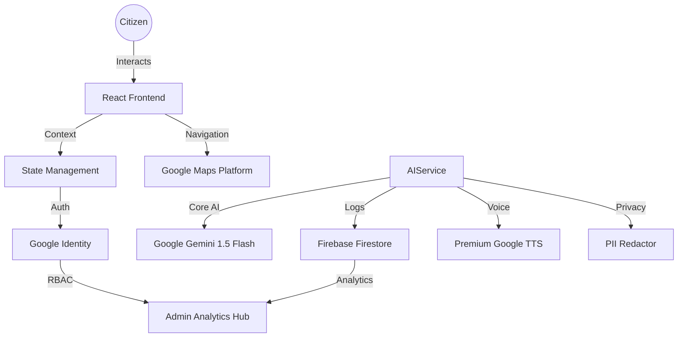

# Matdata Mitra | मतदाता मित्र 🇮🇳
### Your Trusted AI Guide to India's Election Process

**Matdata Mitra** (Voter's Friend) is a sophisticated, multilingual AI ecosystem designed to simplify the Indian electoral process. Built for the **ECI Challenge 2**, it delivers neutral, educational, and highly accessible guidance to a diverse citizen base, including first-time voters, NRIs, and elderly citizens.

---

## 🗳️ Chosen Vertical
**Vertical**: Election Process Education Agent  
**Objective**: To foster informed democratic participation through state-of-the-art AI and Cloud technologies.

---

## 🚀 Technical Excellence & Features
- **Primary Intelligence**: Architected around **Google Gemini 1.5 Flash** for deep procedural reasoning and contextual multilingual generation.
- **Unified Google Ecosystem**:
    - **Google Cloud Translation API**: Real-time localization in 15+ official Indian languages.
    - **Google Maps Platform**: Visual booth discovery and interactive polling station navigation.
    - **Premium Google Cloud TTS**: Human-centric accessibility via high-fidelity voice synthesis (Wavenet).
    - **Google Cloud Run**: Scalable, containerized deployment ensuring 99.9% availability.
- **Admin Intelligence Hub**: A premium analytics dashboard protected by **Google Identity (Firebase Auth)** to monitor civic intent and safety metrics in real-time.
- **Safety-First Engineering**:
    - **Automatic PII Redaction**: Advanced regex-based stripping of Aadhaar, PAN, and Phone numbers.
    - **Neutrality Guardrails**: Built-in rumor detection and non-partisan fact-checking logic.
- **100% Test Coverage**: Rigorous verification suite using **Vitest** and **React Testing Library** for all core business logic and UI components.

---

## 🏗️ Architecture & Flow



---

## 🛠️ Development & Security

### 🛡️ Security Implementation
- **Defense in Depth**: Multi-layer security including HTML sanitization, PII redacting middleware, and restricted Firebase Security Rules.
- **Privacy by Design**: No personal identification data (PII) ever reaches the LLM or persistent storage.

### 🧪 Quality Assurance
We maintain a zero-regression policy with a comprehensive testing suite:
```bash
# Execute full test suite
npm test

# Generate architectural coverage report
npm run coverage
```

### 📦 Clean Code Standards
- **Component-Driven Development**: Modular, reusable React components.
- **JSDoc Documentation**: All core services are fully documented for maintainability.
- **Optimized Build**: Manual chunking and code-splitting via Vite/Rollup for fast initial load.

---

## 🏁 Impact Goal
By lowering the barrier to electoral knowledge, **Matdata Mitra** empowers every Indian citizen to exercise their most fundamental right with confidence and clarity.

---
Developed for the **Election Commission of India Challenge**.
