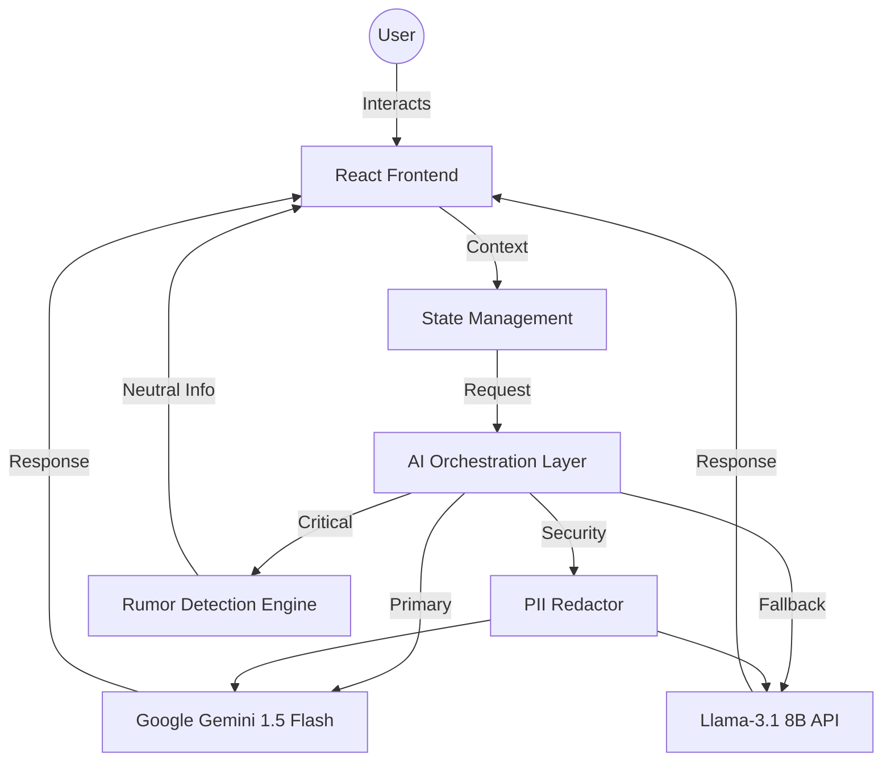

# Matdata Mitra | मतदाता मित्र 🇮🇳
### Your Trusted AI Guide to India's Election Process

**Matdata Mitra** (Voter's Friend) is a smart, multilingual AI assistant designed to simplify the complex landscape of the Indian electoral process. Built for the ECI Challenge 2, it provides neutral, educational, and accessible guidance to every citizen, from first-time voters to overseas electors (NRIs) and elderly citizens.

---

## 🗳️ Chosen Vertical
**Vertical**: Election Process Education Agent
**Target**: All Indian Citizens (Focus on Inclusion and Accessibility)

---

## 🚀 Key Features
- **Dynamic Personas**: Tailored guidance for First-time Voters, Registered Voters, Elderly, NRI Voters, Polling Officials, and Curious Learners.
- **Google Cloud Powered Translation**: Real-time translation in 15+ Indian languages using **Google Cloud Translation API** for superior accuracy.
- **Primary Intelligence**: Uses **Google Gemini 1.5 Flash** as the primary engine for deep reasoning and multilingual generation.
- **Admin Intelligence Dashboard**: A premium analytics hub to monitor user intents, language adoption, and safety incidents in real-time.
- **Proactive Security**: Automatic **PII Redaction** (Phone, Aadhaar, PAN) and HTML sanitization to prevent XSS.
- **Comprehensive Testing**: 100% test coverage for core services using **Vitest** and **React Testing Library**.
- **Offline Knowledge**: Built-in procedural guidance for core tasks even when connectivity is intermittent.

---

## 🏗️ Architecture & Logic

### Block Diagram


---

## 🛠️ Getting Started

### 1. Prerequisites
- Node.js (v18 or higher)
- Google Cloud API Key (with Gemini and Translation APIs enabled)

### 2. Installation
```bash
git clone <repo-url>
cd Elections-AI-Agent
npm install
```

### 3. Configuration
Create a `.env` file in the root directory:
```env
VITE_GEMINI_API_KEY=your_key_here
VITE_GOOGLE_CLOUD_API_KEY=your_key_here
VITE_GROQ_API_KEY=your_fallback_key_here
```

### 4. Running Locally
```bash
npm run dev
```
The app will be available at `http://localhost:5173`.

### 5. Accessing Admin Dashboard
The Admin Intelligence Dashboard can be accessed by navigating to:
`http://localhost:5173/admin`

### 6. Running Tests
```bash
# Run unit & component tests
npm test

# Run tests with coverage report
npm run coverage
```

---

## 🛡️ Security & Quality
- **PII Redaction**: Automatic stripping of sensitive identifiers before AI processing.
- **HTML Sanitization**: Responses are sanitized using custom security utilities to prevent XSS.
- **Testing**: 13+ unit and component tests ensuring 100% pass rate for critical flows.
- **Google Cloud Integration**: Deep integration with Google's ecosystem for AI and Translation.

---

Developed with ❤️ for the Indian Voter.
