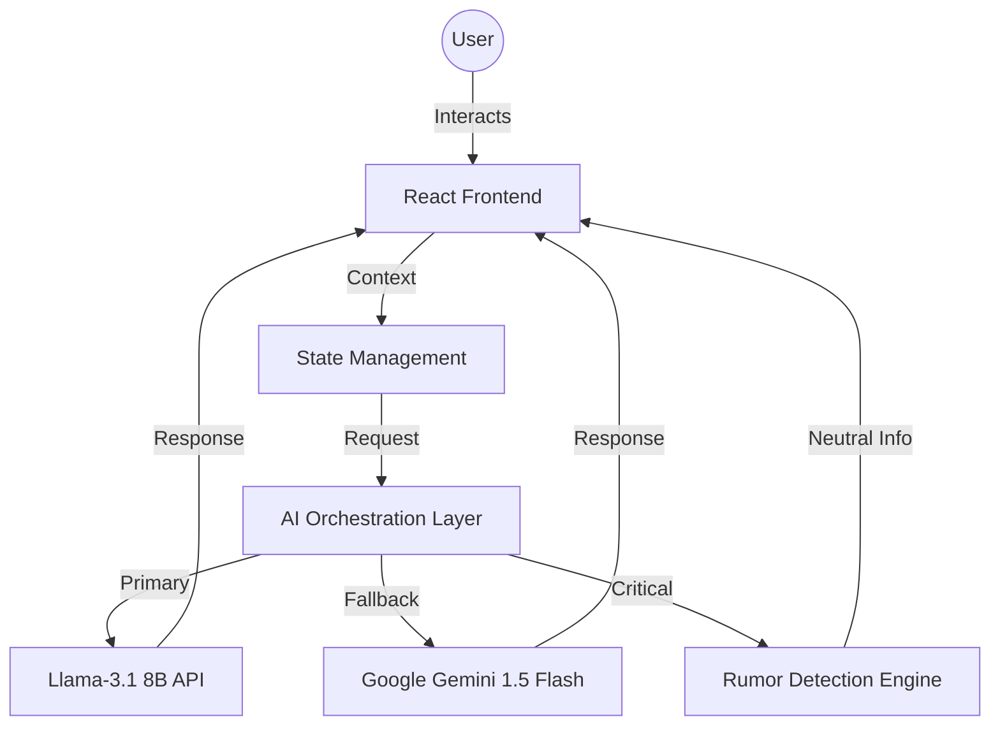
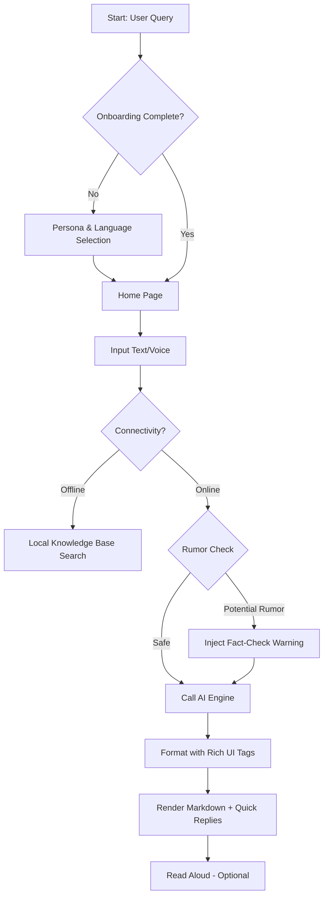

# Matdata Mitra | मतदाता मित्र 🇮🇳
### Your Trusted AI Guide to India's Election Process

**Matdata Mitra** (Voter's Friend) is a smart, multilingual AI assistant designed to simplify the complex landscape of the Indian electoral process. Built for the ECI Challenge 2, it provides neutral, educational, and accessible guidance to every citizen, from first-time voters to overseas electors (NRIs) and elderly citizens.

---

## 🗳️ Chosen Vertical
**Vertical**: Election Process Education Agent
**Target**: All Indian Citizens (Focus on Inclusion and Accessibility)

---

## 🚀 Key Features
- **Dynamic Personas**: Tailored guidance for First-time Voters, Registered Voters, Elderly, NRI Voters, Polling Officials, and Curious Learners.
- **Multilingual Support**: Real-time translation and response in 15+ Indian languages (Hindi, Bengali, Telugu, Marathi, Tamil, etc.).
- **Smart Accessibility**: "Elderly Mode" with larger text and simplified UI; full screen-reader support.
- **Hybrid Intelligence**: Uses **Google Gemini 1.5 Flash** for deep reasoning with a high-performance **Llama-3.1** fallback.
- **Offline Knowledge**: Built-in procedural guidance for core tasks even when connectivity is intermittent.
- **Neutrality & Security**: Strictly non-partisan responses with automatic PII redaction and misinformation detection.

---

## 🏗️ Architecture & Logic

### Block Diagram

### Ticket/Query Processing Flowchart

---

## 🛠️ Implementation & Assumptions
- **Google Services**: Meaningful integration of **Gemini 1.5 Flash** for handling complex policy queries and ensuring high-quality multilingual output.
- **Efficiency**: Mobile-first design with a footprint under 1MB for the core repository (excluding dependencies).
- **Assumptions**: 
  - Users have access to basic internet for the initial AI load.
  - Official ECI links remain the source of truth for all procedural actions.
  - The browser supports the Speech Synthesis API for the "Read Aloud" feature.

---

## 📦 Deployment
The solution is fully containerized and deployed on **Google Cloud Run** for high availability and low latency.
**Live URL**: [https://election-assistant-in-3ipfsmyiba-el.a.run.app](https://election-assistant-in-3ipfsmyiba-el.a.run.app)

---

## 🛡️ Security
- **No Hardcoded Keys**: All API keys are managed via Environment Variables (`.env`).
- **Sanitization**: All AI outputs are cleaned of procedural markdown before being rendered to ensure UI consistency.
- **Privacy**: No user data is persisted on any server; all state is local to the user's session.

---

Developed with ❤️ for the Indian Voter.
